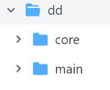

# DungeonsDragonsEnunciado

## Los objetivos de esta tarea son:
- practicar los conceptos fundamentales relacionados con la herencia (sobreescritura, polimorfismo, etc.)
- comprender la importancia de las patrones y principios solid a través del uso de Strategy

## En este repositorio encontrarás:
- Enunciado original adaptado (prof. Fran Montoiro) que describe la tarea. [enunciado original](https://github.com/lozanoSC/dungeonsdragonsenunciado/blob/main/Enunciadooriginal.md)
- Esqueleto de la aplicación que se desprende del enunciado anterior. Los paquetes y clases que aparecen en dicho esqueleto son obligatorios. Podrías, si lo consideras oportuno, añadir clases propias. Puedes hacer fork para crearte una copia rápida de este proyecto.
- Una serie de consideraciones que deberás añadir al enunciado original.
- Un documento con una serie de preguntas a responder al finalizar tu proyecto que deberas incluir en tu proyecto con tu respuesta.

## Al enunciado debes de añadir las siguientes consideraciones que veremos a continuación. 
### Estructura de la aplicación


Las clases que gestionan los arrays y la entrada salida estarán en dd.main. Este paquete contendrá al menos la clase principal (la que contiene el main). Si la gestión es sencilla de los arrays y la E/S, puede bastar con escribir una clase.

Las clases que gestionan los personajes y sus ataques están en dd.core

Antes de lanzarse  a escribir código para lucha de ejércitos, previamente debes de  probar la lucha con personajes sueltos para ver que todo está en orden. De está manera nos centramos por completo en un primer momento en escribir bien la jerarquía que es lo importante. Ten en cuenta además que al trabajar con parámetros Random depurar directamente con ejércitos es más difícil y lioso

Por ejemplo, observa las siguientes pruebas de Lucha. Ten en mente que la jerarquía debe ser independiente de la E/S y entonces,  se puede decidir que el método ataca() devuelva un array de int para tener todos los valores de los ataques e imprimirlos como quiera desde el main().

``` 
package dd.main;

import dd.core.AtaqueArco;
import dd.core.AtaqueEspada;
import dd.core.Personaje;
import dd.core.Rey;
import dd.core.Troll;

public class ControlBasico {
    public static void main(String[] args) {
        //pruebas sin ejercitos ni victorias
        Personaje p1= new Rey("Arturo");
        p1.setAtaque(new AtaqueEspada());
        Personaje p2= new Troll("Troll 1");
        p2.setAtaque(new AtaqueArco());
        System.out.println(p1+","+p1.getAtaque());
        System.out.println(p2+","+p2.getAtaque());
        int[] valoresAtaque=p1.ataca(p2);
        for(int valor:valoresAtaque){
            System.out.println("p1 ataca a p2 y el valor del ataque es: "+
            (valor>0?valor:"falla"));
        }
        System.out.println("comprobar salud actualizada de p2");
        //con salud <=0 lo considero muerto
        System.out.println(p2.getSalud()<=0?"MUERTO" + p2.getNombre():p2);
       
        System.out.println("Vamos a repetir el ataque pero ahora forzando que p2 muera poniendo salud a 1");
        //si todos los ataques son fallidos se salva!!!
        p2.setSalud(1);

        valoresAtaque=p1.ataca(p2);
        //si el ataque puede tener valor 0 para simular un fallo
        for(int valor:valoresAtaque){
            System.out.println("p1 ataca a p2 y el valor del ataque es: "+
            (valor>0?valor:"falla"));
        }

        System.out.println("comprobar salud actualizada de p2");
        System.out.println(p2.getSalud()<0?"MUERTO maldito " + p2.getNombre():p2);
    }
}
```
 
y como ejemplo de salida podría ser(por Random cada ejecución es diferente):

``` 
[Arturo: 2000],Ataque Espada
[Troll 1: 1000],Ataque Arco
p1 ataca a p2 y el valor del ataque es: falla
p1 ataca a p2 y el valor del ataque es: 56
p1 ataca a p2 y el valor del ataque es: 39
comprobar salud actualizada de p2
[Troll 1: 905]
Vamos a repetir el ataque pero ahora forzando que p2 muera poniendo salud a 1
p1 ataca a p2 y el valor del ataque es: falla
p1 ataca a p2 y el valor del ataque es: falla
p1 ataca a p2 y el valor del ataque es: 59
comprobar salud actualizada de p2
MUERTO maldito Troll 1
``` 
Cuando queremos forzar que muera el troll con  saludo 1, puede ocurrir que  todos los ataques dan fallo no moriría,  pero ejecutamos  el main las veces que haga falta para comprobar este caso.

### luchar con  ejércitos sencillos
Una vez que la lucha individual es OK, empiezas a luchar con ejercitos. Si tienes algún error y no lo localizas usa el debug y fuerza la creación de ejércitos más sencillos, por ejemplo comenzamos con  1 caballero 1 troll. luego 1 caballero 2 trolls luego 2 caballeros 1 troll etc. Ya que con los valores del enunciado se va todo de madre para debug.

### Otras observaciones. 
- prohibido usar  println()  en la todas las clases del paquete core.
- Estar bien seguros que cuando se muere todo un ejército se sale de todo bucle, 
- Ojo con los límites,  errores como  que en la vida comprabamos  <0  en lugar de <=0 etc.
- Evita que la estructura de DDApp se base en métodos static. Mejor crea un objeto para que luchen los ejercitos por ejemplo

``` 
public class DDApp {
      public static void main(String[] args) {
      new ControlLucha();
    }
}
``` 
y luego  por ejemplo el constructor podría ser …. ¡pero hazlo a tu gusto!

``` 
ControlLucha() {
    crearEjercitos();
    luchar();
}
``` 

- los arrays de los ejércitos serán atributos de la clase y necesitarás una serie de métodos para hacer la lucha a tu buen criterio. 


- ojo, con las expresiones un  error fácil de cometer es  con la fórmula para ver intensidad de ataque, observa que hay que  se pasa  a int toda la expresión

``` 
int valorAtaque=(int)(Ataque.getAciertoFactor()*ATAQUE_CUCHILLO);
```
- NO ES NECESARIO para esta tarea generar javadoc ni jar. Ya esta aprendido de prácticas anteriores el concepto de "parte pública" de una clase(para lo que generamos javadoc) y asi mismo darse cuenta de la necesidad de ejecutar una App fuera del IDE(para lo que generamos un .jar). Ahora nos ocupamos de otros conceptos.
- Tampoco se pide en dd.main separar la E/S de la lógica del manejo de los arrays de los ejercitos. De nuevo, en esta tarea queremos centrarnos en otros conceptos.

